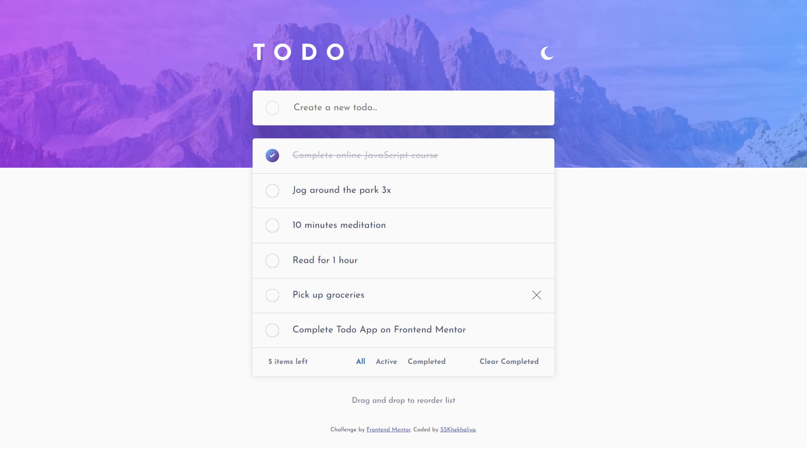

# Frontend Mentor - Todo app solution

This is a solution to the [Todo app challenge on Frontend Mentor](https://www.frontendmentor.io/challenges/todo-app-Su1_KokOW). Frontend Mentor challenges help you improve your coding skills by building realistic projects.

## Table of contents

- [Overview](#overview)
  - [The challenge](#the-challenge)
  - [Screenshot](#screenshot)
  - [Links](#links)
- [My process](#my-process)
  - [Built with](#built-with)
  - [Useful resources](#useful-resources)
- [Author](#author)

## Overview

### The challenge

Users should be able to:

- View the optimal layout for the app depending on their device's screen size
- See hover states for all interactive elements on the page
- Add new todos to the list
- Mark todos as complete
- Delete todos from the list
- Filter by all/active/complete todos
- Clear all completed todos
- Toggle light and dark mode
- **Bonus**: Drag and drop to reorder items on the list

### Screenshot

### Links

- Solution URL: [solution URL](https://github.com/sskhekhaliya/Frontend-Mentor--ToDo)
- Live Site URL: [live site URL](https://sskhekhaliya.github.io/Frontend-Mentor--ToDo)

## My process

### Built with

- CSS custom properties
- Flexbox
- Mobile-first workflow
- [jQuery](http://jquery.com/) - JS library
- [Sortable](https://github.com/SortableJS/Sortable) - JS library

### Useful resources

- [Stackoverflow](https://stackoverflow.com/) - This helped me whenever I stuck during code.
- [w3schools](https://www.w3schools.com/) - This site is really helpful for me all the time.
- [Sortable](https://github.com/SortableJS/Sortable) - Sortable is a JavaScript library for reorderable drag-and-drop lists.

## Author

- Website - [SSKhekhaliya](https://www.sskhekhaliya.com)
- Frontend Mentor - [@sskhekhaliya](https://www.frontendmentor.io/profile/sskhekhaliya)
- Twitter - [@sskhekhaliya](https://www.twitter.com/sskhekhaliya)
- Instagram - [@sskhekhaliya](https://www.instagram.com/sskhekhaliya)
- LinkedIn - [@sskhekhaliya](https://www.linkedin.com/in/sskhekhaliya)
